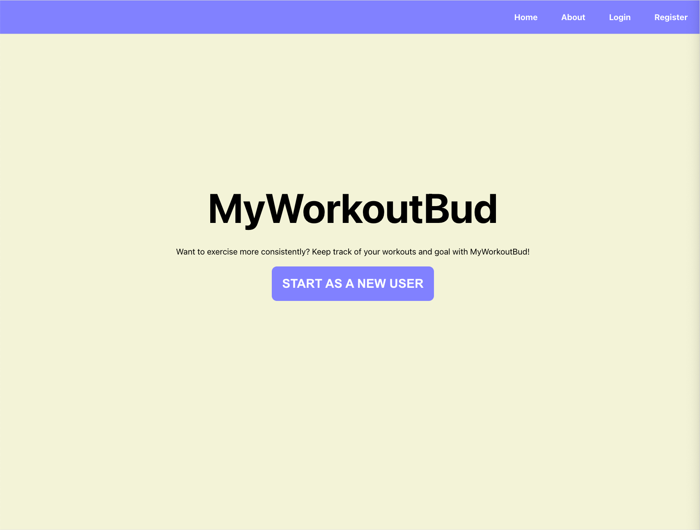
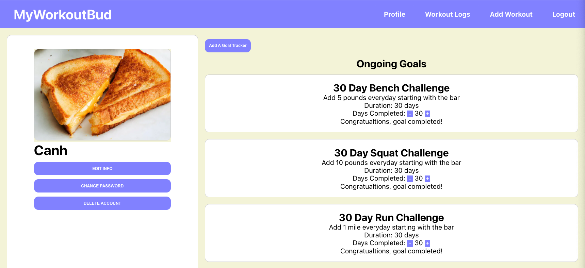

# MyWorkoutBud-Frontend

## Date: 5/4/2022

### By: [Canh Vo](https://www.linkedin.com/in/canhvo16/)

### [Server Repository](https://github.com/canhvo16/MyWorkoutBud-Backend), [Trello](https://trello.com/b/caO6Il0y/myworkoutbud)

---

## **_Overview_**

MyWorkoutBud is a full stack PERN application inspired by MyFitnessPal to help users log their workouts. Users must have an account to use the app where they'll be able to keep track of their exercises and save them to a tracker. They will also be able to set goals for themselves along with seeing the progress for those goals.

---

## **_Technologies_**

- React, Javascript, Html, Css
- Sequelize, Postgres
- Express
- Node.js

---

## **_Screenshots_**

---

## **_Future Update_**

#### After completing this project, I would love to these features:

- Have the application notify them when they haven't logged a workout for the day
- Have users able to interact with each other and see each others logs
- Option to favorite workout logs

---

## **_Credits_**

Images: [Google](https://www.google.com/)
